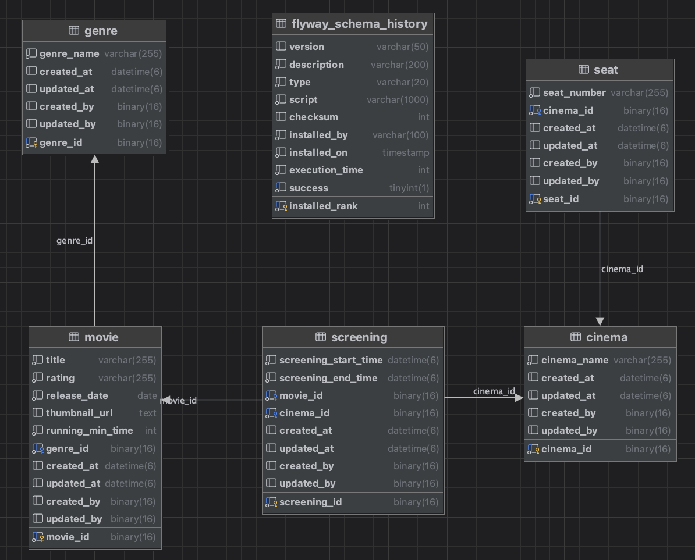

## Multi Module Design

#### **의존관계**
- `presentation` → `application` → `infrastructure`
- `application` → `domain`
- `infrastructure` → `domain`

#### **모듈별 역할**
- 각 모듈의 상세 설명은 해당 모듈 디렉토리 내 README.md 파일을 참고하십시오.

---

## Table Design
- 테이블 구조는 아래의 다이어그램으로 대체됩니다.
- ****

---

## Architecture

- **Port-Adapter 패턴 적용**
    - 각 모듈 간 결합을 제거하여 독립성을 유지합니다.
    - `Application` 계층은 비즈니스 로직만 담당하며, 외부 기술에 의존하지 않습니다.
    - `Infrastructure` 계층은 외부 기술(JPA, DB, API 등)을 담당하며, Port를 통해 `Application`과 통신합니다.

---

## API Design

#### **`GET /api/v1/screenings`**
- 최신 영화별로 그룹핑하여 빠른 시간순으로 정렬된 상영 영화 목록을 반환합니다.
- 기본적으로 오늘부터 2일 이내 상영 영화 목록을 반환하며, 클라이언트 요청에 따라 기간을 조정할 수 있습니다.
- **HTTP 요청 예시**:
    -  IntelliJ Http Client `http/getScreenings.http` 참고.

---

## 프로젝트 주요 특징
- **모듈화된 설계**: 명확한 책임 분리를 통해 유지보수와 확장성을 높임.
- **API 유연성**: 다양한 클라이언트 요청 시나리오를 지원할 수 있는 유연한 파라미터 설계.
- **테이블 설계와 아키텍처**: 프로젝트 구조와 데이터베이스 설계를 통해 높은 일관성과 성능을 유지.

---

## 데이터 관리
- **flyway**로 형상 관리. Movie, Genre, Seat, Cinema 엔티티 생성 및 기본 데이터 생성
- Screening(상영 영화 시간표)는 ``CommandLineRunner``를 구현하여 프로잭트 구동 시 생성
